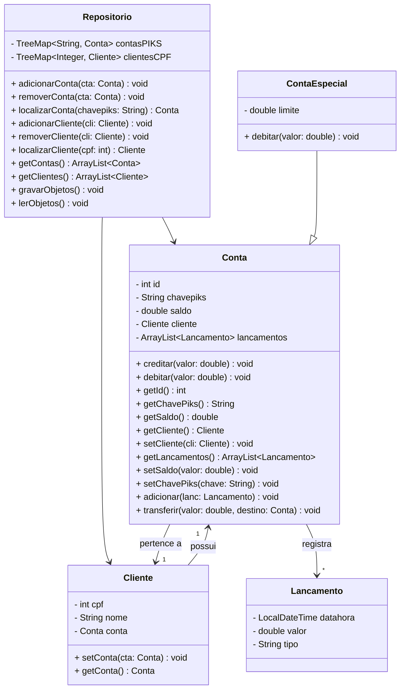

# 💱 Sistema PIKS: Transferência Bancária
> IFPB/JP – TSI – Programação Orientada a Objetos (Prof. Fausto Ayres). Projeto 2.

### Objetivo: Implementar o sistema de transferência bancária PIKS com base nas regras de negócio (requisitos) apresentadas no documento do projeto.
## ➡️ Visão Geral da Estrutura do Projeto
| Arquivo          | Descrição                                                                                  |
|-----------------------------|--------------------------------------------------------------------------------------------|
| **src/appconsole**| versão de interface no console (linha de comando) do sistema |
| **src/appswing**| versão de interface gráfica (Swing) do sistema |
| **src/arquivos**| imagem usada na interface |
| **src/modelo/Cliente** | classe que representa um `Cliente` |
| **src/modelo/Conta** | classe base que representa uma `Conta` bancária |
| **src/modelo/ContaEspecial**| subclasse de `Conta` que representa uma `Conta Especial` |
| **src/modelo/Lancamento** | classe que representa um `Lançamento` de movimentação financeira |
| **src/repositorio/Repositorio** | classe que centraliza o armazenamento (`Repositorio`) e acesso a `Cliente`, `Conta`, `Lancamento`, etc. |
| **data/contasPIKS** | arquivo .csv que guarda as contas do sistema |
| **data/lancamentos**| arquivo .csv que guarda os lançamentos (entradas/saídas) |

---
## ➡️ Requisito de Dados (classes)

